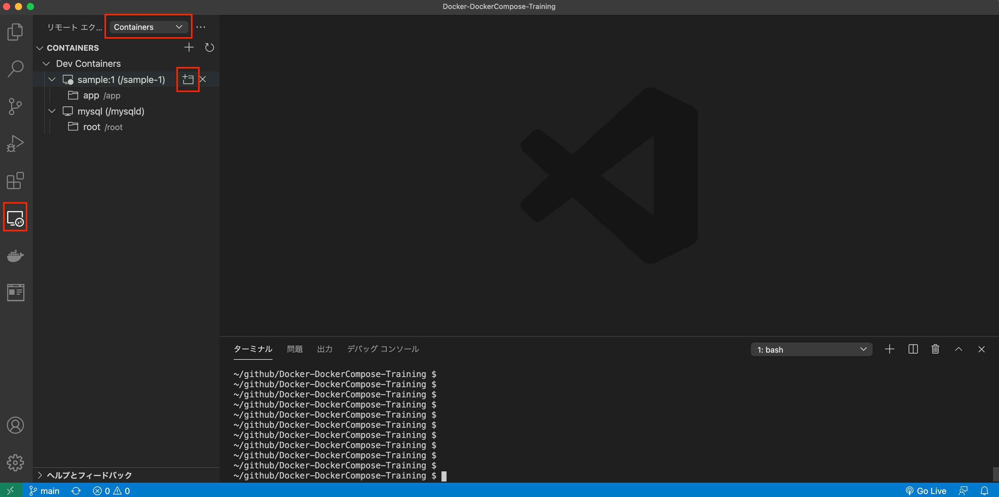
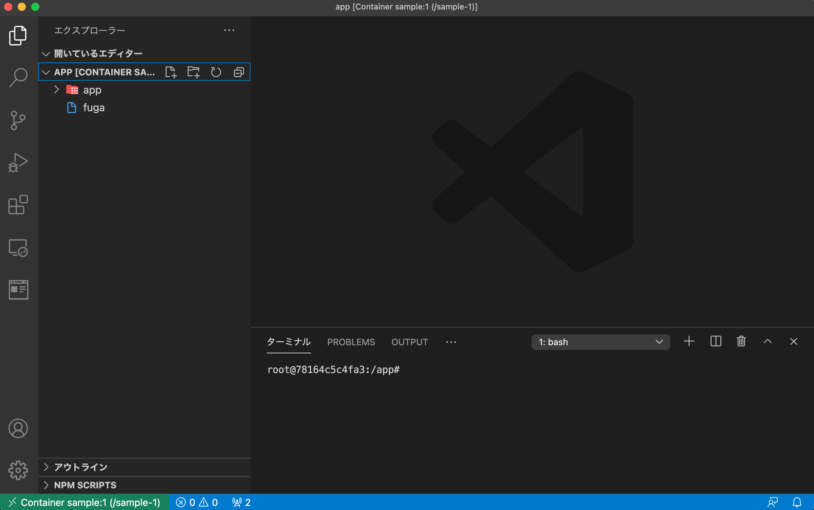
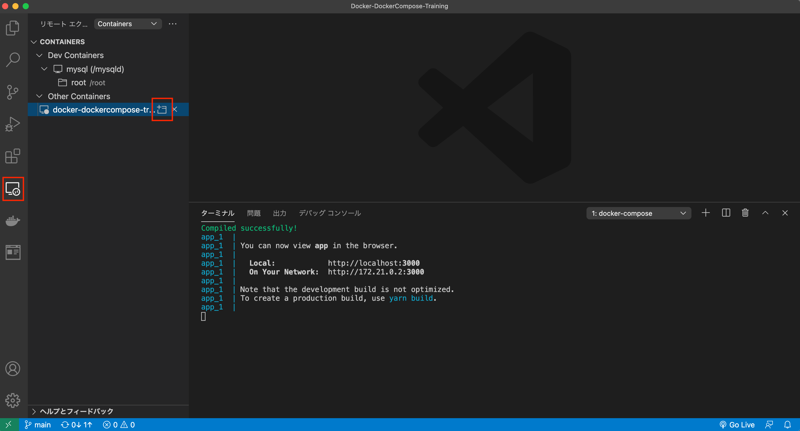
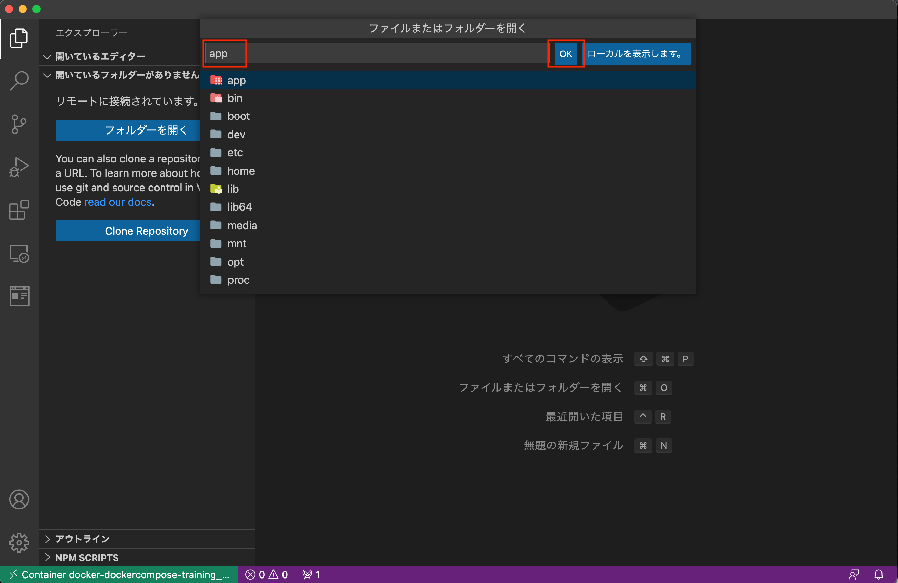

# Docker-DockerCompose-Training

## 動作環境

[Docker](https://www.docker.com/)、[Docker Compose](https://docs.docker.com/compose/)が動作すること([Docker Desktop](https://www.docker.com/get-started)で可能)

Node.js,npmが動作すること

```
$ node -v
v14.15.4
$ npm -v
7.6.0
$ npx -v
7.6.0
$ yarn -v
1.22.10
```

## 公式ドキュメント

[docker docs](https://docs.docker.com/)

## すること

1. Docker で環境構築
   1. docker exec で接続し開発
   1. VSCode から接続し開発
   1. Docker の基本的な操作
1. Docker Compose で環境構築
   1. Docker をマウントし開発
   1. VSCode から接続し開発
   1. Docker Compose の基本的な操作

## 1. Docker で環境構築

### 今回の作業ディレクトリの作成

```
$ mkdir Docker-DockerCompose-Training
$ cd Docker-DockerCompose-Training
```

### サンプルコード用ディレクトリの作成
ReactのサンプルコードをDockerコンテナにマウントする際に利用する`app`ディレクトリを作成する
```
$ mkdir app
```

### gitignoreの作成
[gitignore.io](https://www.toptal.com/developers/gitignore)で`vscode`を指定して作成する(ローカルで作成しても問題ない)

`.gitignore`に以下を追記し管理対象から除外

```
+ app/*
```

### Dockerfile の作成

`docker/app`ディレクトリを作成し配下に`Node.js`環境用の[`Dockerfile`](./docker/app/Dockerfile)を作成する

```
$ mkdir -p docker/app
```

```
$ cat Dockerfile
FROM node:latest

ENV APP_PATH=/app
RUN mkdir $APP_PATH
WORKDIR $APP_PATH
```

### Docker イメージの確認

```
$ docker images
```

### docker build

`Docker-DockerCompose-Training`から実行

```
$ docker build --file=./docker/app/Dockerfile -t sample:1 .
[+] Building 39.6s (7/7) FINISHED                                                                                                                                
 => [internal] load build definition from Dockerfile                                                                                                        0.0s
 => => transferring dockerfile: 115B                                                                                                                        0.0s
 => [internal] load .dockerignore                                                                                                                           0.0s
 => => transferring context: 2B                                                                                                                             0.0s
 => [internal] load metadata for docker.io/library/node:latest                                                                                              4.1s
 => [1/3] FROM docker.io/library/node:latest@sha256:def7bb01cc33bc226e2fb94e6b820e5db9a3793e342c21d70e18ed6e3e3cc68a                                       34.4s
 => => resolve docker.io/library/node:latest@sha256:def7bb01cc33bc226e2fb94e6b820e5db9a3793e342c21d70e18ed6e3e3cc68a                                        0.0s
 => => sha256:def7bb01cc33bc226e2fb94e6b820e5db9a3793e342c21d70e18ed6e3e3cc68a 776B / 776B                                                                  0.0s
 => => sha256:ed78ee5153382701a4ca5d363a56b526fca073841186b70b9ed1c280dee92363 2.21kB / 2.21kB                                                              0.0s
 => => sha256:56bc674036dc4e2bd2cd490939d04842c10a0c195c9184363573860c359086fc 7.83kB / 7.83kB                                                              0.0s
 => => sha256:16cf3fa6cb1190b4dfd82a5319faa13e2eb6e69b7b4828d4d98ba1c0b216e446 45.38MB / 45.38MB                                                           10.9s
 => => sha256:3ddd031622b35dad4be68eec6ac0787b0394f37b3dbb600a04e8b2363297b8d7 11.27MB / 11.27MB                                                            2.4s
 => => sha256:69c3fcab77df556f3a56ec3d2a5b5cc304f4c4d4341b6f8423dd86ebe5ddaebb 4.34MB / 4.34MB                                                              2.6s
 => => sha256:a403cc031caeb1ddbae71b9f7e47d7854415c8aa6f0b84b8e7be4b3db513867e 49.79MB / 49.79MB                                                            6.3s
 => => sha256:b900c5ffbaf4b4884b18eb27cec8a890510d745d6a65ba90efe10c9cdeaaade8 214.34MB / 214.34MB                                                         22.3s
 => => sha256:f877dc3acfca02604e73fb01208848941a1718b55297038decc5464f36edd649 4.19kB / 4.19kB                                                              6.5s
 => => sha256:6779ae40941d54401cbb2a16e55b2a4e2dcaf635aaf5c0edc1140867660fbd78 34.05MB / 34.05MB                                                            9.7s
 => => sha256:cc22e2b1bc09a54e7d1fb7dc84f037cedba749071cc5fa0f9056232054801884 2.38MB / 2.38MB                                                             10.2s
 => => sha256:70e96dddd4f16fb4e8cbe8c671d40acdb485440e5346e86eca021b82d7c739e2 294B / 294B                                                                 10.4s
 => => extracting sha256:16cf3fa6cb1190b4dfd82a5319faa13e2eb6e69b7b4828d4d98ba1c0b216e446                                                                   2.5s
 => => extracting sha256:3ddd031622b35dad4be68eec6ac0787b0394f37b3dbb600a04e8b2363297b8d7                                                                   0.8s
 => => extracting sha256:69c3fcab77df556f3a56ec3d2a5b5cc304f4c4d4341b6f8423dd86ebe5ddaebb                                                                   0.2s
 => => extracting sha256:a403cc031caeb1ddbae71b9f7e47d7854415c8aa6f0b84b8e7be4b3db513867e                                                                   2.7s
 => => extracting sha256:b900c5ffbaf4b4884b18eb27cec8a890510d745d6a65ba90efe10c9cdeaaade8                                                                   9.3s
 => => extracting sha256:f877dc3acfca02604e73fb01208848941a1718b55297038decc5464f36edd649                                                                   0.1s
 => => extracting sha256:6779ae40941d54401cbb2a16e55b2a4e2dcaf635aaf5c0edc1140867660fbd78                                                                   1.6s
 => => extracting sha256:cc22e2b1bc09a54e7d1fb7dc84f037cedba749071cc5fa0f9056232054801884                                                                   0.2s
 => => extracting sha256:70e96dddd4f16fb4e8cbe8c671d40acdb485440e5346e86eca021b82d7c739e2                                                                   0.0s
 => [2/3] RUN mkdir /app                                                                                                                                    0.9s
 => [3/3] WORKDIR /app                                                                                                                                      0.0s
 => exporting to image                                                                                                                                      0.0s
 => => exporting layers                                                                                                                                     0.0s
 => => writing image sha256:22d744614838a22ae305967921f49f179fac325b2f4987a3f54511180075f7bf                                                                0.0s
 => => naming to docker.io/library/sample:1           
```

### Docker イメージの確認
buildで作成したイメージ`sample`が存在すること

```
$ docker images
REPOSITORY   TAG       IMAGE ID       CREATED              SIZE
sample       1         43a2ae7ab3ee   About a minute ago   936MB
```

### Docker コンテナの確認
イメージをコンテナと起動していないため何も出力されないこと

```
$ docker ps -a
```

### 新しい Docker コンテナの起動
**`pwd`がローカルで実行できない場合、フルパスを出力し書き換えて実行する**

```
$ docker run -v `pwd`/app:/app -it -d --name sample-1 -p 3000:3000 sample:1
```

### Docker コンテナの確認
**`CONTAINER ID`を今後は指定するので控えること**

`NAMES`に`sample-1`が存在し`STATUS`が`UP`であること

```
$ docker ps -a
CONTAINER ID   IMAGE      COMMAND                  CREATED          STATUS                     PORTS                               NAMES
54306bc7ef99   sample:1   "docker-entrypoint.s…"   29 seconds ago   Up 28 seconds              0.0.0.0:3000->3000/tcp              sample-1
```

### 1.1 docker exec で接続し開発

`docker ps -a`で確認した`CONTAINER ID`を`-it`以降に指定する

```
$ docker exec -it 54306bc7ef99 bash
```

#### ファイルの作成と確認

```
# touch hoge
# ls -la
total 8
drwxr-xr-x 2 root root 4096 Feb  8 06:20 .
drwxr-xr-x 1 root root 4096 Feb  8 06:18 ..
-rw-r--r-- 1 root root    0 Feb  8 06:20 hoge

# exit
```

#### ファイルの確認
`app`内に`hoge`が存在すれば`docker`にマウントが成功している

```
$ ls -la app
total 0
drwxr-xr-x  3 miurahironori  staff   96  2  8 15:29 .
drwxr-xr-x  4 miurahironori  staff  128  2  8 15:28 ..
-rw-r--r--  1 miurahironori  staff    0  2  8 15:29 hoge
```

### 1.2 VSCode から接続し開発

#### 拡張機能のインストール

VSCode -> 拡張機能 -> [Remote Development](https://marketplace.visualstudio.com/items?itemName=ms-vscode-remote.vscode-remote-extensionpack)をインストール

#### 接続

`sample:1`の横の`+`を押下後、ディレクトリ(フォルダー)の入力を聞かれた場合は`/app`を入力


新しいウインドウで作成した Docker 環境に接続し開発ができる状態であること


fuga と言うファイルを追加し`Docker-DockerCompose-Training`から確認

```
$ ls -la app
total 0
drwxr-xr-x  3 miurahironori  staff   96  2  8 15:29 .
drwxr-xr-x  4 miurahironori  staff  128  2  8 15:28 ..
-rw-r--r--  1 miurahironori  staff    0  2  8 15:29 hoge
-rw-r--r--  1 miurahironori  staff    0  2  8 15:33 fuga
```

### 1.3 Docker の基本的な操作

#### Docker イメージの確認

```
$ docker images
REPOSITORY   TAG       IMAGE ID       CREATED             SIZE
sample       1         43a2ae7ab3ee   About an hour ago   936MB
node         latest    96e42e8537de   2 days ago          936MB
```

#### build

**build 済みなので実行しない**

~~初回は`Docker-DockerCompose-Training`から実行~~

```
$ docker build --file=./docker/app/Dockerfile -t sample:1 .
```

#### Docker コンテナの確認

```
$ docker ps -a
CONTAINER ID   IMAGE      COMMAND                  CREATED          STATUS                     PORTS                               NAMES
d621283c4a42   sample:1   "docker-entrypoint.s…"   16 minutes ago   Up 16 minutes              0.0.0.0:3000->3000/tcp              sample-1
```

#### 新しい Docker コンテナの起動

**実行済みなので実行しない**

~~初回は`Docker-DockerCompose-Training`から実行~~

```
$ docker run -v `pwd`/app:/app -it -d --name sample-1 -p 3000:3000 sample:1
```

#### Docker コンテナの停止

`docker ps -a`で確認した`CONTAINER ID`を指定

```
$ docker stop d621283c4a42
```

#### Docker コンテナの起動

`docker ps -a`で確認した`CONTAINER ID`を指定

```
$ docker start d621283c4a42
```

#### Docker コンテナの削除

停止後`docker ps -a`で確認した`CONTAINER ID`を指定

```
$ docker rm d621283c4a42
```

確認

```
$ docker ps -a
```

#### Docker イメージの削除

`docker images`で確認した`IMAGE ID`を指定

```
$ docker images
REPOSITORY   TAG       IMAGE ID       CREATED        SIZE
sample       1         43a2ae7ab3ee   2 hours ago    936MB

$ docker rmi 43a2ae7ab3ee
```

### 掃除

`app`内を掃除

```
$ rm app/*
```

コンテナから開いていたVSCodeも閉じる

## 2. Docker Compose で環境構築

### React サンプルコードの準備
ローカルの`Docker-DockerCompose-Training`直下から実行

```
$ cd app
$ npx create-react-app .
```

### docker-compose.yml の作成

`Docker-DockerCompose-Training` 直下に[docker-compose.yml](./docker-compose.yml)を作成

```
$ cat docker-compose.yml
version: "3"
services:
  app:
    build: docker/app
    tty: true
    volumes:
      - ./app:/app
    ports:
      - "3000:3000"
    user: node
    command: yarn start
```

### up

Docker-DockerCompose-Training で実行

```
$ docker-compose up
```

`Compiled successfully!`となること


ブラウザにサンプルコードが`http://localhost:3000`で表示されること(確認後、Ctrl+C で停止)


### 2.1 Docker をマウントし React のサンプルコードを用い開発

`app/src/App.js`を編集し`hello`と表示されることを確認しましょう

```
import React from 'react'

const App = () => {
 return (
   <>
     hello
   </>
 );
}

export default App;
```

### 2.2 VSCode から接続し開発

#### 接続

リモートエクスプローラー -> 今回作成した Docker-Compose の環境を選択



フォルダを押下


`app`を指定し`OK`を押下(2 回)


#### 開発

`app/src/App.js`を編集し`docker compose hello`と表示されることを確認しましょう

### 2.3 Docker Compose の基本的な操作

#### 起動

フォアグランドで起動(停止は Ctrl+C)

```
$ docker-compose up
```

バックグラウンドで起動

```
$ docker-compose up
```

#### 起動

```
$ docker-compose start
```

#### 停止

```
$ docker-compose stop
```

#### 確認

```
$ docker-compose ps
               Name                              Command               State           Ports
-----------------------------------------------------------------------------------------------------
docker-dockercompose-training_app_1   docker-entrypoint.sh yarn  ...   Up      0.0.0.0:3000->3000/tcp
```
