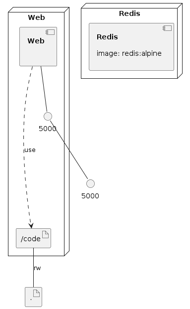

# Docker-DockerCompose-Training

## 公式ドキュメント

[docker docs](https://docs.docker.com/)

## 動作環境

[Docker](https://www.docker.com/)、[Docker Compose](https://docs.docker.com/compose/)が動作すること([Docker Desktop](https://www.docker.com/get-started)で可能)

## recipe

- [tips](./tips/)
  1. [mysql-backup-restore](./tips/mysql-backup-restore/)
     1. MySQL コンテナのバックアップリストア
  2. [network-node-mysql](./tips/network-node-mysql/)
     1. docker の network 機能を用いてコンテナ間の通信の設定サンプル。 具体的には node(`node-app`)コンテナと mysql(`mysqld`)コンテナをコンテナ名で通信できるよう設定する
- [recipe-1](./recipe-1/README.md)
  1. Docker で環境構築
     1. docker exec で接続し開発
     1. VSCode から接続し開発
     1. Docker の基本的な操作
  2. Docker Compose で環境構築
     1. Docker をマウントし開発
     1. VSCode から接続し開発
     1. Docker Compose の基本的な操作
- [recipe-2-0](./recipe-2-0/README.md)
  1. 全体を通して Docker、Docker Compose の基本的な使い方の理解
  2. 全体を通して VSCode から Docker コンテナに接続しアプリケーションコードを作成
  3. docker を用いてフロントサーバ、API サーバをたて連携(Part 1)
  4. 3 の環境構築を Docker Compose で行う(Part 2)
  5. (Training) 4 で改めて環境構築した環境で 3 のアプリを実装(Part 3)し他の機能も追加する
- [recipe-2-1](./recipe-2-1/README.md)
  1. [recipe-2-0](./recipe-2-0/README.md) に MySQL を追加、express-app を router で書き直し
- [recipe-2-2](./recipe-2-2/README.md)
  1. [recipe-2-0](./recipe-2-0/README.md),[recipe-2-1](./recipe-2-1/README.md) に jwt,cookie,csrf を追加
- [recipe-mysql-dockerfile](./recipe-mysql-dockerfile/README.md)
  1. Dockerfile を用いた MySQL の環境構築
- [recipe-mysql-no-dockerfile](./recipe-mysql-no-dockerfile/README.md)
  1. Dockerfile を用いずコマンドのみでの MySQL の環境構築
- [recipe-python-flask-blueprint](./recipe-python-flask-blueprint/README.md)
  1. Docker で Flask の開発環境（Blueprint を用いたサンプルコード`sample`配下まで配置）の構築例
- [recipe-rails-postgresql](./recipe-rails-postgresql)
  1. rails + PostgreSQL の環境
- [recipe-postgresql-dockerfile](./recipe-postgresql-dockerfile)
  1. PostgreSQL 単体の環境
- [recipe--nginx-react-express-mysql]
  1. Nginx + React + Express + MySQL の環境レシピ(React は build image を Nginx に volume の共有で認識させる)
- [recipe-https-nginx-typescript-react-express-mysql](./recipe-https-nginx-typescript-react-express-mysql)
  1. HTTPS + Nginx + TypeScript + React + Express + MySQL の環境レシピ(HTTPS は Nginx に証明書を設定する、React は build image を Nginx に volume の共有で認識させる)
- [recipe-docker-nginx-express](./recipe-docker-nginx-express)
  1. docker-compose での Web(Nginx) + API(express) の環境構築

### Infrastructure model

