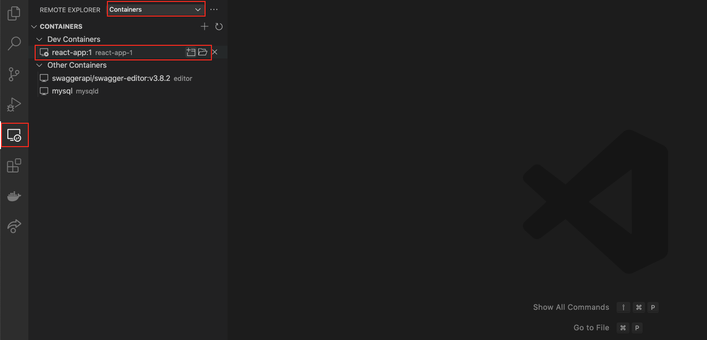
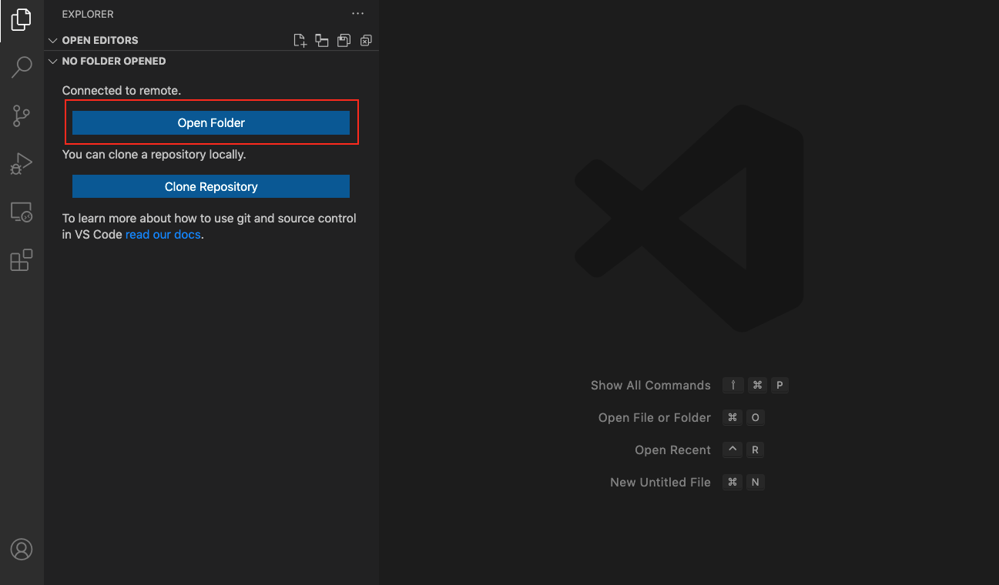
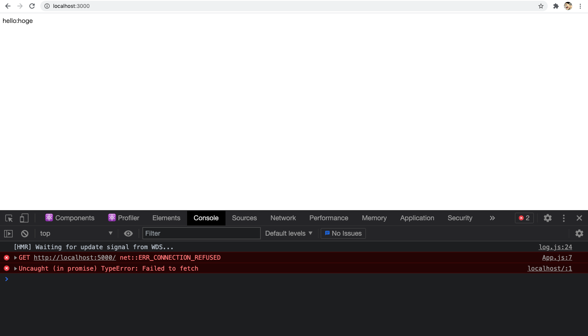
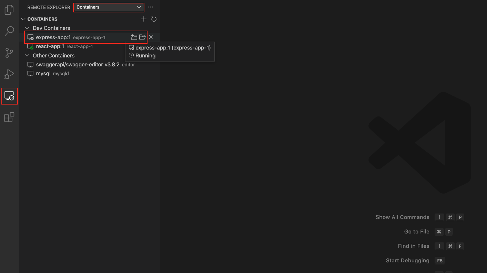
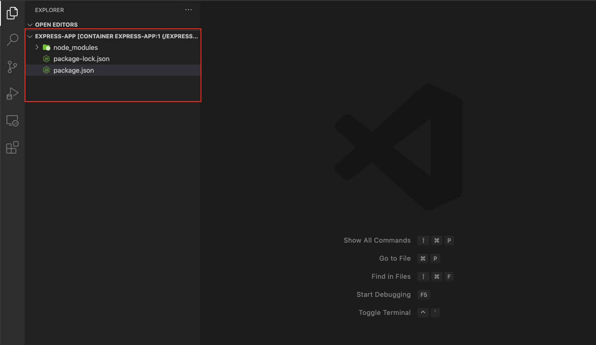
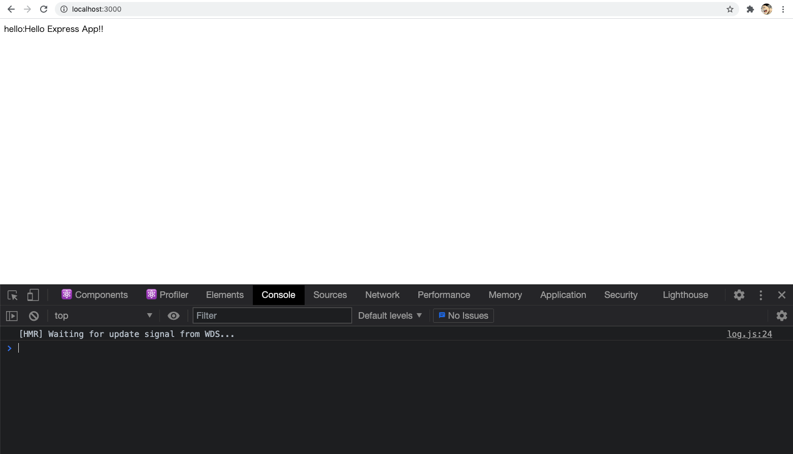
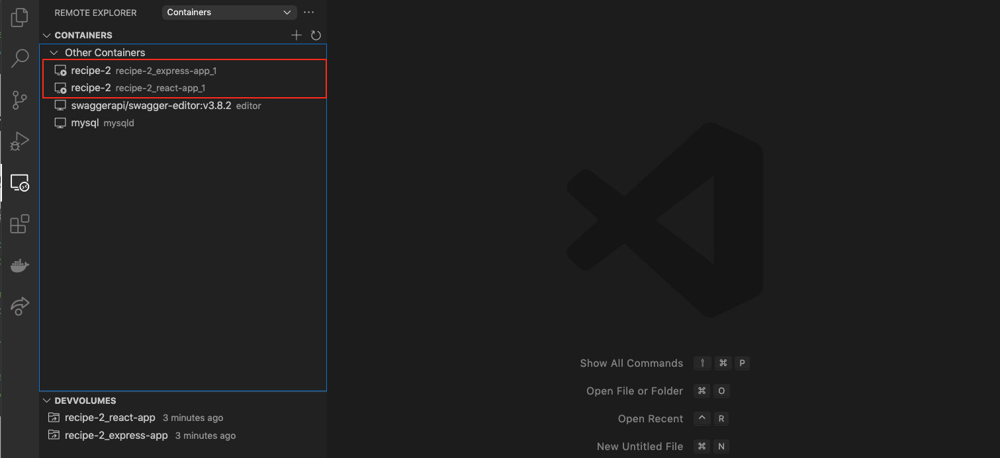

# Docker-React-Express

## 事前準備

Docker

VSCode

## すること

1. 全体を通して Docker、Docker Compose の基本的な使い方の理解
2. 全体を通して VSCode から Docker コンテナに接続しアプリケーションコードを作成
3. docker を用いてフロントサーバ、API サーバをたて連携(Part 1)
4. 3 の環境構築を Docker Compose で行う(Part 2)
5. 4 で改めて環境構築し 3 のアプリを実装(Part 3)

## Paet 0(準備)

今回のハンズオンを行うためのディレクトリを作成し VSCode で開く(以降は`Docker-React-Express`がホームディレクトリとなり特に指定がない場合は`Docker-React-Express`からコマンドを実行する)

```
$ mkdir Docker-React-Express
$ code Docker-React-Express
```

## Part 1

ここでは docker で 2 つのコンテナを立ち上げフロントサーバ、API サーバとして動作させます

### フロントサーバ(react-app)

ここでは React アプリを立ち上げるための node 環境を docker で立ち上げていきます

#### create Dockerfile

docker ファイルの格納ディレクトリ`docker/react-app`を作成する(VSCode のターミナル、Exploer から直接作成のどちらでも良い)

```
$ mkdir -p docker/react-app
```

上記ディレクトリ配下に`Dockerfile`として`cat`で表示した内容を転記する

```
$ cat Dockerfile
FROM node:latest

ENV APP_PATH=/react-app
RUN mkdir $APP_PATH
WORKDIR $APP_PATH

RUN npx create-react-app .
```

#### image build

docker イメージを作成します。確認 -> 作成 -> 確認の手順で行います

確認

```
$ docker image ls
REPOSITORY                  TAG       IMAGE ID       CREATED         SIZE
```

作成

```
$ docker image build --file=./docker/react-app/Dockerfile -t react-app:1 .
```

確認(`react-app`が存在すること)

```
$ docker image ls
REPOSITORY                  TAG       IMAGE ID       CREATED          SIZE
react-app                   1         29ad70606561   32 seconds ago   1.23GB
```

#### volume create

今回立ち上げるコンテナに mount し永続化する volume を作成します(※ Mac 以外は要確認)。確認 -> 作成 -> 確認の手順で行います

確認

```
$ docker volume ls
DRIVER    VOLUME NAME
```

作成

```
$ docker volume create react-app
```

確認(`react-app`が存在すること)

```
$ docker volume ls
DRIVER    VOLUME NAME
local     react-app
```

#### container up

docker コンテナの起動(port 3000 で React アプリはアクセスするよう設定)確認 -> 起動 -> 確認の手順で行います

確認(`-a`は停止しているコンテナも出力)

```
$ docker container ls -a
CONTAINER ID   IMAGE                              COMMAND                  CREATED       STATUS                     PORTS                               NAMES
```

起動

```
$ docker container run -p 3000:3000 --mount type=volume,src=react-app,dst=/react-app -it -d --name react-app-1 react-app:1
```

確認(`react-app-1`の STATUS が`UP`になっていること)

```
$ docker container ls -a
CONTAINER ID   IMAGE                              COMMAND                  CREATED          STATUS                     PORTS                                       NAMES
f1f0a91fb71d   react-app:1                        "docker-entrypoint.s…"   46 seconds ago   Up 41 seconds              0.0.0.0:3000->3000/tcp, :::3000->3000/tcp   react-app-1
```

#### VSCode で接続

`Remote Explorer`から`Containers`を選択し`react-app:1`のディレクトリを押下



Open Folder を押下



`react-app`ディレクトリを指定(もしくは入力)し OK を押下


React アプリの環境が作成されていることを確認


#### アプリ起動

以降は上で接続した VSCode で作業を行います

React のサンプルをターミナルから起動

```
$ yarn start

Compiled successfully!

You can now view react-app in the browser.

  Local:            http://localhost:3000
  On Your Network:  http://172.17.0.2:3000

Note that the development build is not optimized.
To create a production build, use yarn build.
```

起動完了後`localhost:3000`で React アプリが動作していることを確認(違う port で開いた場合は 3000 に書き換えて確認)


#### サンプルコード React

[src/Index.js](./sample/react-app/Index.js)を以下に修正

```

import React from 'react';
import ReactDOM from 'react-dom';
import App from './components/App'

ReactDOM.render(
<React.StrictMode>
<App />
</React.StrictMode>,
document.getElementById('root')
)

```

`src/App.js`を[src/components/App.js](./sample/react-app/components/App.js)として修正

```

import React,{useState,useEffect} from 'react'

const App = () => {
const [message,setMessage] = useState("hoge")

useEffect(() => {
fetch('http://localhost:5000/')
.then(response => response.json())
.then(data => setMessage(data.message))
},[])

return (
<div>
hello:{message}
</div>
)
}

export default App
```

念のためターミナルで起動しているアプリを Ctrl + C で停止し再起動(3000)

```
$ yarn start
```

dev tools を立ち上げ確認(現在は API サーバをたてていないのでエラーとなる)



### API サーバ(express-app)

ここでは Express にて API サーバをを立ち上げるための node 環境を docker で立ち上げていきます

#### create Dockerfile

docker ファイルの格納ディレクトリ`docker/express-app`を作成する(VSCode のターミナル、Exploer から直接作成のどちらでも良い)

```
$ mkdir -p docker/express-app
```

上記ディレクトリ配下に`Dockerfile`として`cat`で表示した内容を転記する

```
FROM node:latest

ENV APP_PATH=/express-app
RUN mkdir $APP_PATH
WORKDIR $APP_PATH

RUN npm init -y
RUN npm install -y express cors
```

#### image build

docker イメージを作成します。確認 -> 作成 -> 確認の手順で行います

確認(先に作成した`react-app-1`が存在)

```
$ docker image ls
REPOSITORY                  TAG       IMAGE ID       CREATED             SIZE
react-app                   1         29ad70606561   About an hour ago   1.23GB
```

作成

```
$ docker image build --file=./docker/express-app/Dockerfile -t express-app:1 .
```

確認(`express-app`が作成されていること)

```
$ docker image ls
REPOSITORY                  TAG       IMAGE ID       CREATED             SIZE
express-app                 1         007fdae2e275   20 seconds ago      914MB
react-app                   1         29ad70606561   About an hour ago   1.23GB
```

#### volume create

今回立ち上げるコンテナに mount し永続化する volume を作成します(※ Mac 以外は要確認)。確認 -> 作成 -> 確認の手順で行います

確認(先に作成した`react-app`が存在)

```
$ docker volume ls
DRIVER    VOLUME NAME
local     react-app
```

作成

```
$ docker volume create express-app
```

確認(`express-app`が存在すること)

```
$ docker volume ls
DRIVER    VOLUME NAME
local     express-app
local     react-app
```

#### container up

docker コンテナの起動(port 5000 で Expres API サーバはアクセスするよう設定)確認 -> 起動 -> 確認の手順で行います

確認(`-a`は停止しているコンテナも出力)

```
$ docker container ls -a
CONTAINER ID   IMAGE                              COMMAND                  CREATED             STATUS                     PORTS                                       NAMES
f1f0a91fb71d   react-app:1                        "docker-entrypoint.s…"   About an hour ago   Up About an hour           0.0.0.0:3000->3000/tcp, :::3000->3000/tcp   react-app-1
```

起動

```
$ docker container run -p 5000:5000 --mount type=volume,src=express-app,dst=/express-app -it -d --name express-app-1 express-app:1
```

確認(`express-app-1`の STATUS が`UP`になっていること)

```
$ docker container ls -a
CONTAINER ID   IMAGE                              COMMAND                  CREATED             STATUS                     PORTS                                       NAMES
e0d2b654f0dd   express-app:1                      "docker-entrypoint.s…"   14 seconds ago      Up 11 seconds              0.0.0.0:5000->5000/tcp, :::5000->5000/tcp   express-app-1
f1f0a91fb71d   react-app:1                        "docker-entrypoint.s…"   About an hour ago   Up About an hour           0.0.0.0:3000->3000/tcp, :::3000->3000/tcp   react-app-1
```

#### VSCode で接続

`Remote Explorer`から`Containers`を選択し`express-app:1`のディレクトリを押下



Open Folder を押下


`express-app`ディレクトリを指定(もしくは入力)し OK を押下


Express アプリの環境が作成されていることを確認


#### サンプルコード Express

以降は上で接続した VSCode で作業を行います

[index.js](./sample/express-app/index.js)を`express-app`直下に作成

```
const express = require('express')
const app = express()
const cors = require('cors')
const http = require('http')
const server = http.createServer(app)

app.use(cors({
origin: 'http://localhost:3000',
credentials: true,
optionsSuccessStatus: 200
}))

app.get('/',(req,res) => {
res.json({
message:"Hello Express App!!"
})
})
server.listen(5000,() => {
console.log('listening on \*:5000')
})
```

#### アプリ起動

Express アプリをターミナルから起動(5000)

```
$ node index.js
listening on *:5000
```

ブラウザでアクセスしている React アプリをリロードし API 呼び出しが行われたか確認(エラーが消えメッセージが変わっていることを確認)



#### 基本操作

確認

```
$ docker container ls -a
CONTAINER ID   IMAGE                              COMMAND                  CREATED       STATUS                     PORTS                                       NAMES
e0d2b654f0dd   express-app:1                      "docker-entrypoint.s…"   2 hours ago   Up 2 hours                 0.0.0.0:5000->5000/tcp, :::5000->5000/tcp   express-app-1
f1f0a91fb71d   react-app:1                        "docker-entrypoint.s…"   3 hours ago   Up 3 hours                 0.0.0.0:3000->3000/tcp, :::3000->3000/tcp   react-app-1
```

bash モードで接続

```
$ docker container exec -it express-app-1 bash
root@e0d2b654f0dd:/express-app# ls -la
total 52
drwxr-xr-x  3 root root  4096 May 24 11:03 .
drwxr-xr-x  1 root root  4096 May 24 10:17 ..
-rw-r--r--  1 root root   391 May 24 11:06 index.js
drwxr-xr-x 54 root root  4096 May 24 10:17 node_modules
-rw-r--r--  1 root root 32438 May 24 10:13 package-lock.json
-rw-r--r--  1 root root   297 May 24 10:13 package.json
root@e0d2b654f0dd:/express-app# exit
exit
```

停止(+確認)

```
$ docker container stop express-app-1
express-app-1
$ docker container ls -a
CONTAINER ID   IMAGE                              COMMAND                  CREATED       STATUS                        PORTS                                       NAMES
e0d2b654f0dd   express-app:1                      "docker-entrypoint.s…"   2 hours ago   Exited (137) 15 seconds ago                                               express-app-1
f1f0a91fb71d   react-app:1                        "docker-entrypoint.s…"   3 hours ago   Up 3 hours                    0.0.0.0:3000->3000/tcp, :::3000->3000/tcp   react-app-1
```

起動(+確認)

```
$ docker container start express-app-1
express-app-1
$ docker container ls -a
CONTAINER ID   IMAGE                              COMMAND                  CREATED       STATUS                     PORTS                                       NAMES
e0d2b654f0dd   express-app:1                      "docker-entrypoint.s…"   2 hours ago   Up 19 seconds              0.0.0.0:5000->5000/tcp, :::5000->5000/tcp   express-app-1
f1f0a91fb71d   react-app:1                        "docker-entrypoint.s…"   3 hours ago   Up 3 hours                 0.0.0.0:3000->3000/tcp, :::3000->3000/tcp   react-app-1
```

#### 掃除

react-app

```
$ docker container stop react-app-1
$ docker container rm react-app-1
$ docker volume rm react-app
$ docker image rm react-app:1
```

express-app

```
$ docker container stop express-app-1
$ docker container rm express-app-1
$ docker volume rm express-app
$ docker image rm express-app:1
```

## Part 2

ここでは Part 1 で構築した環境を Docker Compose で作成していきます

[docker-compose.yml](./docker-compose.yml)を直下に作成

```
version: "3"
services:
  react-app:
    build: docker/react-app
    tty: true
    volumes:
      - react-app:/react-app
    ports:
      - "3000:3000"
    user: node

  express-app:
    build: docker/express-app
    tty: true
    volumes:
      - express-app:/express-app
    ports:
      - "5000:5000"
    user: node
volumes:
  react-app:
  express-app:
```

起動(フォワグランド実行)(`-d`をつけることでバックグラウンドで起動可能)

```
$ docker-compose up

Creating recipe-2_react-app_1   ... done
Creating recipe-2_express-app_1 ... done
Attaching to recipe-2_express-app_1, recipe-2_react-app_1
express-app_1  | Welcome to Node.js v16.2.0.
express-app_1  | Type ".help" for more information.
react-app_1    | Welcome to Node.js v16.2.0.
react-app_1    | Type ".help" for more information.
```

#### Express VSCode で接続

`Remote Explorer`から`Containers`を選択し`express-app_1`のディレクトリを押下



Open Folder を押下


`express-app`ディレクトリを指定(もしくは入力)し OK を押下


Express アプリの環境が作成されていることを確認


#### React VSCode で接続

`Remote Explorer`から`Containers`を選択し`react-app_1`のディレクトリを押下


Open Folder を押下


`react-app`ディレクトリを指定(もしくは入力)し OK を押下


React アプリの環境が作成されていることを確認


#### 基本操作

一旦、現在フォアグランドで立ち上げている docker-compose を Ctrl+C で停止する

```
^CGracefully stopping... (press Ctrl+C again to force)
Stopping recipe-2_express-app_1 ... done
Stopping recipe-2_react-app_1   ... done
```

確認 1

```
$ docker-compose ps
         Name                     Command             State     Ports
---------------------------------------------------------------------
recipe-2_express-app_1   docker-entrypoint.sh node   Exit 137
recipe-2_react-app_1     docker-entrypoint.sh node   Exit 137
```

確認 2

```
$ docker compose ls -a
NAME                STATUS
recipe-2            exited(2)
```

起動(バックグラウンド起動)

```
$ docker-compose start
Starting react-app   ... done
Starting express-app ... done
```

停止

```
$ docker-compose stop
Stopping recipe-2_express-app_1 ... done
Stopping recipe-2_react-app_1   ... done
```

削除

```
$ docker-compose rm
Going to remove recipe-2_express-app_1, recipe-2_react-app_1
Are you sure? [yN] y
Removing recipe-2_express-app_1 ... done
Removing recipe-2_react-app_1   ... done
```

#### 掃除

上記操作の場合は image,volume は残るため改めて削除する

```
$ docker image rm recipe-2_express-app
$ docker image rm recipe-2_react-app
$ docker volume rm recipe-2_express-app
$ docker volume rm recipe-2_react-app
```

## Part 3

ここでは Part 1,2 で行った環境構築、AP の実装を改めて行いましょう

起動

```
$ docker-compose up --build -d
```

Express,React の Docker 環境に VSCode で接続しアプリを実装しましょう
