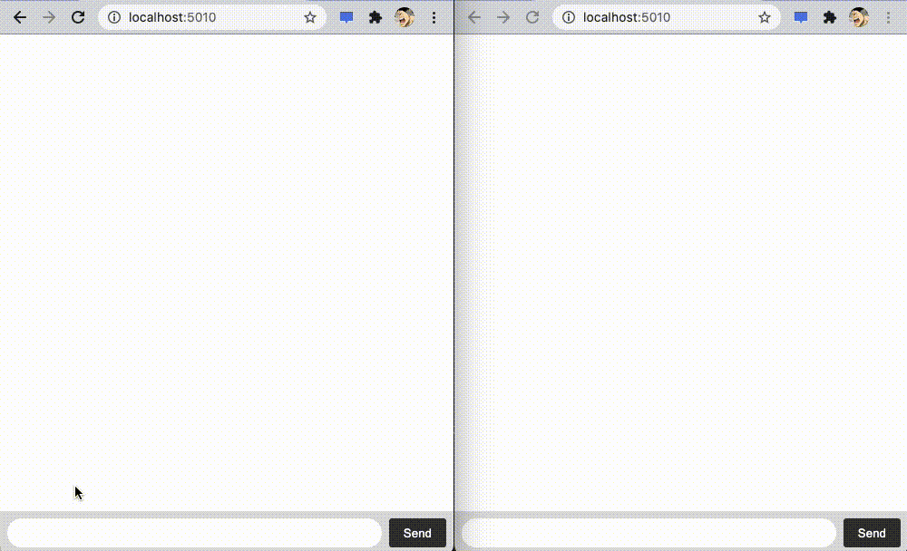

# recipe-express-socketio-redis

socket-io を使ったチャットを複数サーバから行うために redis を用いた例(この構築ではシングル構成)



## run

```
docker-compose up -d --build
```

VSCode remote explorer から express-app に接続。ディレクトリは`/express-app/`を選択

TERMINAL から`node main.js`を実行

ブラウザで`localhost:5010`を開きチャットができれば正常に起動
