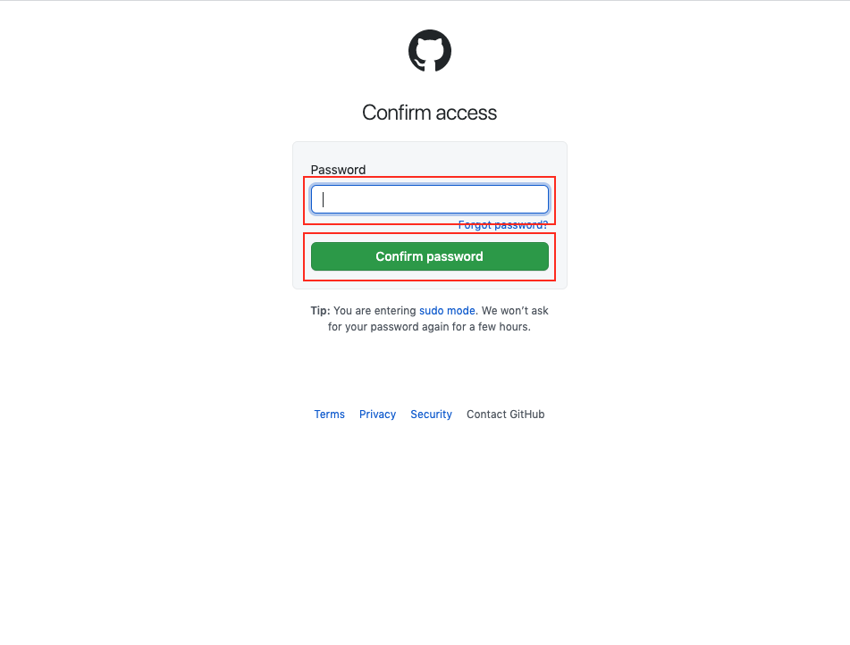

# VSCode + Git & GitHub

VSCode Remote Explorer から Docker コンテナに接続し Git&GitHub を扱う例

ターミナルを開く

`git init`

```
# git init
```

`config`の設定

```
# git config --global user.name hironomiu
# git config --global user.email hironomiu@gmail.com
# git config --global init.defaultBranch main
```

コードの add commit

```
# git add .
# git commit -m "commited"
```

リモートリポジトリの設定(今回は https で実行)

```
# git remote add origin https://github.com/hironomiu/xxxx.git
# git branch -M main
# git push -u origin main
```

`git push`を初回行うと VSCode から認証を聞かれるので指示通り進む

`Continue` を押下


`Authorize github`を押下


GitHub アカウントのパスワードを入力し`Confirm password`を押下



対象のリポジトリに push が成功していることを確認（以降は設定されているのでこのオペレーションは不要）
